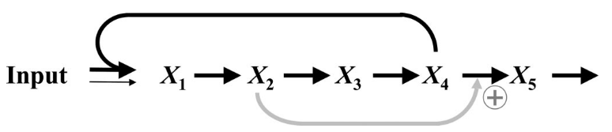
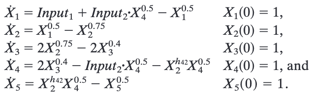
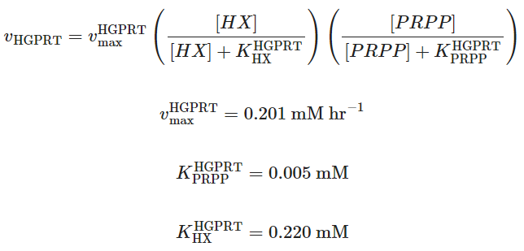
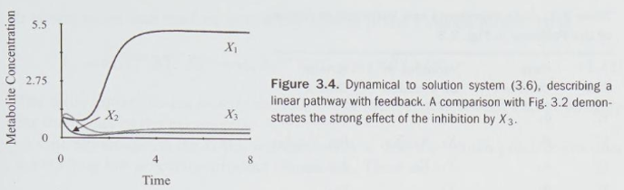
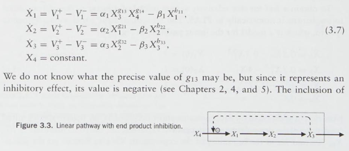
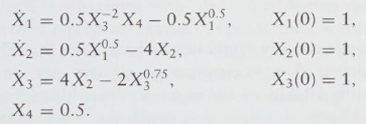

# biochemistry-jl
Biochemistry simulations in Julia.

## Setup

### Install the Julia environment

Julia dependencies for this repo need to be installed. From the root of this repo, type `julia`. At the prompt, type `]`. Then type the following:

```
(@v1.10) pkg> activate .
(biochemistry-jl) pkg> instantiate
```

After the latter command finishes, type backspace, then:

```
julia> exit()
```

### Jupyter Notebooks for Quarto and Julia Jupyter Support

First, create a virtual environment for **Python** and install Jupyter Lab in it. This is required for Quarto builds of Julia. Run these commands from the root of the repo:

```
conda create --prefix env python=3.11
conda activate ./env
conda install jupyterlab
```

[See this page for additional guidance.](https://quarto.org/docs/projects/virtual-environments.html)

### The Julia Kernel for Jupyter

To run this part of the setup, the Python environment above should be activated so that Jupyter can install an additional kernel.

[First install IJulia according to these instructions.](https://julialang.github.io/IJulia.jl/stable/manual/installation/). In brief, the relevant commands are:

```
julia
using Pkg
Pkg.add("IJulia")
using IJulia
installkernel("Julia", "--project=@.")
```

### Quarto installation

[This only needs to be done once per machine for each upgrade of Quarto.](https://quarto.org/docs/get-started/)

### FINALLY! Check the Quarto installation

```
quarto check jupyter
```

If everything comes back good, you are ready!

## Michaelis-Menten kinetics

### Still plot on an HTML report

```
conda activate ./env
cd mm_basic
quarto render mm_basic_kinetics.qmd
```

After quarto finishes, open `mm_basic_kinetics.html` in a browser.

### Animated K<sub>M</sub> and V<sub>max</sub> plot for video creation

```
cd mm_animation
julia --project=.. render_mm_km_animation.jl
```

Then open the `mm_km_animation.mp4` and `mm_vmax_animation.mp4` files in that folder.

## Linear pathway from Voit et al.

### Overview of simulation

This system comes from the paper by Voit et al found at:

> Voit, E., Neves, A. R. & Santos, H. The intricate side of systems biology. Proc. Natl. Acad. Sci. U.S.A. 103, 9452–9457 (2006).

The metabolic pathway is a simplified glycolytic pathway, as shown in Figure 4 of the paper. The description is "Generic linear feedforward activated pathway in which a downstream metabolite (X4) is needed as a second substrate for the first step."



The differential equations that model this system are given in Equation 1 of the paper, as shown below:



The variables X<sub>n</sub> correspond to the following metabolites:

| Variable | Metabolite |
| -------- | ---------- |
| X1       | G6P        |
| X2       | FBP        |
| X3       | 3-PGA      |
| X4       | PEP        |
| X5       | Pyruvate   |

Input1 is a small steady stream of glucose, while Input2 is stream of glucose of concentration over time.

### How to run and plot simulation

To run a simulation to reproduce Figure 5 of Voit et al. and create an animation based on that figure, run these commands:

```
cd linear_pathway_animation
julia --project=.. render_lineary_pathway_animation.jl
```

Then image and movie files will be rendered to that folder.

## Hill Equation

### Overview of simulation

The Hill equaiton models cooperativitiy in binding of ligands to a protein. There are 3 types of cooperativity:

1. Non-cooperativity: Where binding of a ligand does not affect the binding of subsequent lignads.
2. Negative cooperativity: Where binding of one ligand lowers affinity for subsequent ligands.
3. Positive cooperativity: Where binding of one ligand increases affinity for subsequent ligands.

The animation from this script walks through each of these types of cooperativity.

### How to run and plot simulation

```
cd hill_animation
julia --project=.. render_hill_animations_and_stills.jl
```

## Connected Reversible Linear Reaction

### Overview of the simulation

More documentation is in the Quarto document. But, in brief, it (1) reproduces a figure in the SB2 textbook (referenced in the document) as well as employs a simple linear solver to find the fluxes through an example from the book

### Still plot on an HTML report

```
conda activate ./env
cd connected_reversible_linear
quarto render reaction_solver.qmd
```

After quarto finishes, open `reaction_solver.html` in a browser.

## Michaelis-Menten two-substrate kinetics

### Overview of the simulation

This simulation is of the HGPRT enzyme in humans, which follows the rate law:



Citation:

> Joshi, A. & Palsson, B. O. Metabolic dynamics in the human red cell. Part III—Metabolic reaction rates. Journal of Theoretical Biology 142, 41–68 (1990).

### Running the simulation

The following commands will display an OpenGL window with the surface of reactions rates and the script will pause execution waiting for a new line to exit the script. This is so the OpenGL window appears long enough for interaction.

```
cd mm_2_substrate
julia --project=.. two_substrate.jl
```

## Linear with Feedback S-System

### Overview of the simulation

This demo is based on Figure 3.4 from Voit and Ferreira. As presented in the book, the system will exhibit the following behavior:



It is based on the following equations:



with the following initial conditions:



Citation:

> Voit, E. O. & Ferreira, A. E. N. Computational Analysis of Biochemical Systems: A Practical Guide for Biochemists and Molecular Biologists. (Cambridge University Press, Cambridge New York, 2000).
